# รายงานตรวจ Flow และบัญชี FIELD POS — 9 ตุลาคม 2026

## ผลและขอบเขต

ตรวจจาก branch เดิม `feat/pwa-app-shell` ที่ head เริ่มต้น `558df57` และ working tree สะอาด ไม่สมมติ commit ก่อนหน้า ตรวจทั้งโค้ดหน้าเมนู การคำนวณ การบันทึกธุรกรรม และผลรายงาน ใช้ฐานข้อมูล libSQL ไฟล์ใหม่แยกจากร้านจริง รันทดสอบเปิดจนปิดวันสองสถานการณ์ สถานการณ์ละ **85 API-handler calls** พร้อม login จริงในฐานข้อมูลจำลอง ไม่มีการขายหรือรับเงินจริง

การตรวจหน้าเว็บใช้ build/TypeScript, frontend render tests และ regression ที่มีอยู่ การทดสอบนี้ไม่ได้เดินทุกหน้าด้วยมือถือจริงหรือผ่าน HTTPS browser จึงยังต้องทำ Android/UAT และ Beam จริงก่อน release

## Flow ที่ตรวจ

```mermaid
flowchart LR
  A[ล็อกอินและตรวจสิทธิ์] --> B[เปิดกะและล็อกเงินตั้งต้น]
  B --> C[เลือกเมนู สูตร จำนวน และตรวจสต๊อก]
  C --> D[รับชำระ / ตรวจ QR กับผู้ให้บริการ]
  D --> E[บันทึกบิล สต๊อก ต้นทุน คิว ใน transaction]
  E --> F[ผลิต → เรียกคิว → ส่งมอบ]
  F --> G[รายจ่าย ซื้อสต๊อก เงินเข้าออก]
  G --> H[นับเงินอิสระ → ปิดวัน]
  H --> I[เทียบรายบิล รายงาน CSV และ Delivery settlement]
```

| หน้า / เบื้องหลัง | หลักฐานที่ตรวจ | ผลและข้อจำกัด |
|---|---|---|
| Login / Session / เมนูตามสิทธิ์ | API authentication/CSRF, permissions, mobile navigation tests | anonymous ถูกปฏิเสธ; ไม่ใช่การรับรองมือถือจริง |
| เปิดร้าน / Cash shift | เปิดด้วย 500.10; เปิดซ้ำด้วยยอดอื่นถูกปฏิเสธ | เงินตั้งต้นคงเดิม |
| Menu / POS / สูตร / Availability | regression เมนู ราคา สูตร stock, ทดสอบขายราคา 55.25 | ยอดสตางค์ไม่ถูกปัดทิ้งบนหน้าชำระ |
| รับออเดอร์ / Checkout | 12 บิลต่อสถานการณ์; replay ทุก request | บิลและสต๊อกไม่ซ้ำ |
| Cash / Bank / Card | ตรวจยอดรับ เงินทอน ช่องทาง และรายบิล | Bank/Card เป็นการบันทึกยืนยันด้วยคน ยังไม่ตรวจธนาคาร/processor จริง |
| QR / Split | regression 60-bill mixed-payment, charge reuse, currency/identity, HMAC, recovery/expiry | Beam ยังไม่พร้อม; เป็น provider fixtures ไม่ใช่รับเงินจริง |
| Queue / ส่งออเดอร์ / ส่งมอบ | complete_item → call → return, FIFO/replay regressions | คิวสุดท้ายว่าง; LINE เป็น fixture/outbox evidence ไม่ได้ส่งข้อความจริง |
| ยกเลิกก่อนผลิต | VOID บิล 11 | คืนสต๊อก ไม่เหลือยอดรายรับ |
| คืนเงินหลังส่งมอบ | REFUND บิล 12 และ replay | ไม่คืนวัตถุดิบที่ใช้แล้ว ลง WASTE 19.60 ครั้งเดียว |
| ซื้อ Stock | รับถ้วย 20 ใบ 60 บาททาง bank | เพิ่ม stock และ Purchase Spend; ไม่หักเป็น COGS ซ้ำ |
| Expenses | cash 50.25, bank 80.25/1,080.25, refund loss noncash 19.60 | ตรวจผิดช่องทางชำระแล้วปฏิเสธ |
| เงินลิ้นชักเข้า/ออก | เติม 100.20, นำออก 200.30, นำออกเกินยอดถูกปฏิเสธ | ไม่ปนเป็นรายรับ/รายจ่ายธุรกิจ |
| Close day | นับก่อนเห็น expected; ไม่ให้ปิดขณะมีออเดอร์เปิด | ปิดซ้ำ / ขาย / เพิ่มรายจ่ายหลังปิดถูกปฏิเสธ |
| Reports / Dashboard / CSV | เทียบยอด API, daily summary, dashboard และ exports | GP ถูกหักในกำไรดำเนินงานแล้ว; ไม่เปลี่ยน gross profit |
| Delivery settlement | 77.34 ตรง; 76.34 ขาด 1.00; ไม่ให้ reconcile กลุ่มเดิมซ้ำ | variance ถูกเก็บแยก ต้องตรวจสาเหตุก่อนปรับบัญชี |
| Backup / Audit / Offline / Settings | regression ที่มีอยู่ รวม recovery, storage commit, schema/backup, readiness | ยังต้องซ้อม restore และ kill/relaunch บนอุปกรณ์ UAT จริง |

## รายบิลที่ตรวจ — ทั้งสองสถานการณ์ใช้ชุดเดียวกัน

ราคาต่อบิล 55.25 บาท หนึ่งแก้ว ต้นทุนสูตร 19.60 บาท เงินสดรับ 100 บาท ทอน 44.75 บาท

| ลำดับบิล | ช่องทาง | ยอดบิล | สถานะสุดท้าย | รายรับที่รับรู้ |
|---:|---|---:|---|---:|
| 1–3 | เงินสด | 55.25 ต่อบิล | paid / ส่งมอบ | 165.75 รวม |
| 4–6 | bank | 55.25 ต่อบิล | paid / ส่งมอบ | 165.75 รวม |
| 7–8 | card | 55.25 ต่อบิล | paid / ส่งมอบ | 110.50 รวม |
| 9–10 | Grab / other | 55.25 ต่อบิล | paid / ส่งมอบ | 110.50 รวม |
| 11 | เงินสด | 55.25 | void ก่อนผลิต | 0 |
| 12 | เงินสด | 55.25 | refunded หลังส่งมอบ | 0 |

ยอดบิลทั้งหมดก่อนยกเลิก/คืนเงิน 663.00 − VOID 55.25 − REFUND 55.25 = **552.50** ยอดขายสุทธิจาก 10 บิล paid ไม่ใช้การบวกรายการ CSV ทุกสถานะโดยไม่กรอง เพราะ CSV Sales เก็บทั้ง paid/void/refunded เพื่อการตรวจสอบย้อนหลัง

## งบสิ้นวันสองสถานการณ์

| รายการ | A: มีกำไร แต่เงินลิ้นชักขาด | B: ขาดทุน แต่เงินลิ้นชักตรง |
|---|---:|---:|
| รายรับขายสุทธิ | 552.50 | 552.50 |
| COGS ของบิล paid | 196.00 | 196.00 |
| กำไรขั้นต้น | 356.50 | 356.50 |
| GP Delivery | 33.16 | 33.16 |
| รายจ่าย cash | 50.25 | 50.25 |
| รายจ่าย bank | 80.25 | 1,080.25 |
| วัตถุดิบเสียจากคืนเงิน (noncash) | 19.60 | 19.60 |
| รายจ่ายดำเนินงานรวม | 150.10 | 1,150.10 |
| **กำไร / ขาดทุนดำเนินงาน** | **173.24** | **−826.76** |
| ซื้อสต๊อก (bank แยกจาก COGS) | 60.00 | 60.00 |
| ลิ้นชักคาดหวัง | 515.50 | 515.50 |
| นับได้จริง | 514.25 | 515.50 |
| **เงินสดขาด / เกิน** | **−1.25** | **0.00** |
| Delivery คาดรับหลัง GP | 77.34 | 77.34 |
| Delivery ยืนยันรับแบบจำลอง | 77.34 | 76.34 |
| **Delivery variance** | **0.00** | **−1.00** |

กำไรดำเนินงาน = รายรับขาย − COGS − รายจ่ายดำเนินงาน − GP

GP คิดรายบิล: 55.25 × 30% ปัดเป็น 16.58 บาท × 2 บิล = 33.16 บาท จึงไม่ใช้การปัดครั้งเดียวจากยอดรวม 110.50 × 30% ที่จะให้ 33.15 บาท

เงินลิ้นชัก = 500.10 เงินตั้งต้น + 165.75 ยอดขายเงินสดสุทธิ + 100.20 เติมเงิน − 50.25 รายจ่ายเงินสด − 200.30 นำออก = **515.50** การโอน/card/Delivery และซื้อสต๊อกผ่าน bank ไม่กระทบลิ้นชัก

## สต๊อกและมูลค่า

| วัตถุดิบ | ตั้งต้น | ใช้จริง 11 แก้ว | ซื้อเพิ่ม | คงเหลือ |
|---|---:|---:|---:|---:|
| Matcha | 1,000 g | 55 g | 0 | 945 g |
| Milk | 30,000 ml | 1,210 ml | 0 | 28,790 ml |
| Cup | 500 ใบ | 11 ใบ | 20 ใบ | 509 ใบ |

ใช้จริง 11 แก้ว = 10 แก้วที่ยังเป็นยอดขาย + 1 แก้วคืนเงินหลังผลิต บิล VOID คืน stock จึงไม่กินยอดสุทธิ มูลค่า stock ตั้งต้น 5,300.00 − COGS 196.00 − refund loss 19.60 + ซื้อเพิ่ม 60.00 = **5,144.40** คิดจากต้นทุนปัจจุบันตามระบบ ไม่ใช่ FIFO/weighted-average inventory accounting

## วิเคราะห์เชิงลึกและจุดที่แก้

1. **Delivery เคยทำให้กำไรสูงเกินจริง**: GP มีในบิลแต่ไม่ได้ส่งเข้า profitSummary แก้ให้ Daily Summary, Dashboard และ Close day หัก GP ตามบิล สรุปและหน้าปิดวันแสดง GP แยก ก่อนแก้ regression นี้ล้มเหลว หลังแก้ผ่าน
2. **เศษเลข floating point เคยทำให้ cash variance ไม่เป็นศูนย์**: 0.10 + 0.20 ไม่เท่ากับ 0.30 แบบเลขฐานสอง แก้การกระทบยอดด้วยจำนวนเต็มสตางค์ รวม guard นำเงินออก และปัดกำไรสุดท้ายสองตำแหน่ง โดยไม่ลดความละเอียดต้นทุนต่อหน่วย ก่อนแก้ regression ล้มเหลว หลังแก้ผ่าน
3. **ช่องทางรายจ่ายผิดสะกดเคยผ่าน API**: อาจทำให้ยอดที่ควรหักลิ้นชักถูกนับเป็นช่องทางอื่น เพิ่ม validation cash/bank/other ก่อนบันทึก
4. **ป้าย Cash Out ทั้งหมดชวนเข้าใจผิด**: ผลรวมมีรายการ noncash เช่น stock waste เปลี่ยนชื่อบนหน้า Expenses เป็น “รวมรายจ่ายและซื้อสต๊อก” และทำการเทียบ category แบบไม่แยกตัวพิมพ์ใหญ่เล็ก
5. **กำไรต่างจากกระแสเงินสด**: A รับสุทธิหลัง GP 519.34 − ค่าใช้จ่ายที่จ่ายเงินจริง 130.50 − ซื้อ stock 60.00 = เงินจากการดำเนินรายการสุทธิ 328.84 ก่อนย้ายเงิน/เงินตั้งต้น/เงินขาด แต่กำไร 173.24 ต่างกัน 155.60 จาก COGS และ noncash waste เทียบกับการซื้อ stock จึงห้ามใช้ยอดลิ้นชักเป็นกำไร
6. **ขาดเงินไม่ได้แปลว่าธุรกิจขาดทุน**: A มีกำไร 173.24 แต่ลิ้นชักขาด 1.25; B ขาดทุน 826.76 แต่ลิ้นชักตรง การบันทึกผลต่างเป็นรายจ่ายจริงต้องตรวจหาสาเหตุ ไม่ลงหักกำไรอัตโนมัติหรือหักซ้ำ
7. **Delivery variance ยังเป็นรายการตรวจสอบ**: B ได้รับน้อยกว่าคาด 1 บาท ระบบเก็บ variance แต่ยังไม่ลงปรับ P&L อัตโนมัติ ต้องพิสูจน์ว่าเป็นค่าธรรมเนียมเพิ่ม ส่วนลด ภาษีหัก หรือจ่ายไม่ครบก่อนปรับ ไม่มีการอ้างว่ายอดธนาคารจริงผ่าน

## ข้อจำกัดที่ต้องรู้ก่อนใช้งานจริง

- นี่คือรายงานดำเนินงาน POS ไม่ใช่งบการเงินแบบบัญชีคู่ครบชุด ยังไม่มีงบดุล เงินทุน/หนี้สิน ค่าเสื่อมราคา ภาษีและกระทบยอด bank statement เต็มระบบ กำไรไม่ใช่กำไรสุทธิทางภาษี
- GP ตามตั้งค่าและ bank/card confirmation ต้องเทียบหลักฐานจริง หลัง settlement มีผลต่างจะต้องจัดการแยก
- เงินที่ผู้ใช้ส่งตรง API เกินสองตำแหน่งทศนิยมยังต้องกำหนดนโยบายรับ/ปัดให้ครบทุกประเภทข้อมูลก่อนรับรองความแม่นยำระดับบัญชี; หลักฐานรอบนี้ใช้เงินบาทสองตำแหน่ง
- ตัวเลขสต๊อกและ COGS ยังใช้สูตร/ต้นทุนที่มี ถ้าต้นทุนไม่ยืนยัน กำไรจะเป็นค่าประมาณ
- ประวัติ close เดิมเป็น snapshot ไม่ถูกเขียนแก้ย้อนหลังจากการเปลี่ยนสูตรกำไรครั้งนี้ ต้องตรวจบิล Delivery เก่าที่ปิดไปแล้วแยกหากต้อง restate
- Windows native libSQL เคย crash ในรันแรกของ evidence runner รันสุดท้ายผ่าน; ทดสอบ serial พร้อมเพิ่มพื้นที่ GC และตรวจ Linux CI แยก ไม่ถือ native crash เป็น test pass
- ยังต้อง HTTPS Preview + ฐานข้อมูล UAT แยก, Android install/keyboard/offline kill-relaunch, restore rehearsal และ Beam จริงอย่างน้อย 60 บิลชำระสำเร็จตามข้อกำหนดเดิม

## ไฟล์รายงาน

แต่ละสถานการณ์มี JSON หลักฐานเต็ม และ CSV: Daily Summary, Sales, Sale Items, Expenses, Stock, Cash Movements, Bills และ Delivery Settlement รวมสองสถานการณ์เป็น **16 CSV + 2 JSON** เปิด CSV ด้วย Excel/Google Sheets ได้ ใช้ UTF-8 BOM ส่วนรายงานอ่านเป็น Markdown/HTML ไม่มีการส่งข้อมูลร้านจริงหรือ credentials ในไฟล์เหล่านี้

ผล validation สุดท้ายและ commit/CI จะระบุใน PR #112 พร้อมรายงานผู้ใช้
